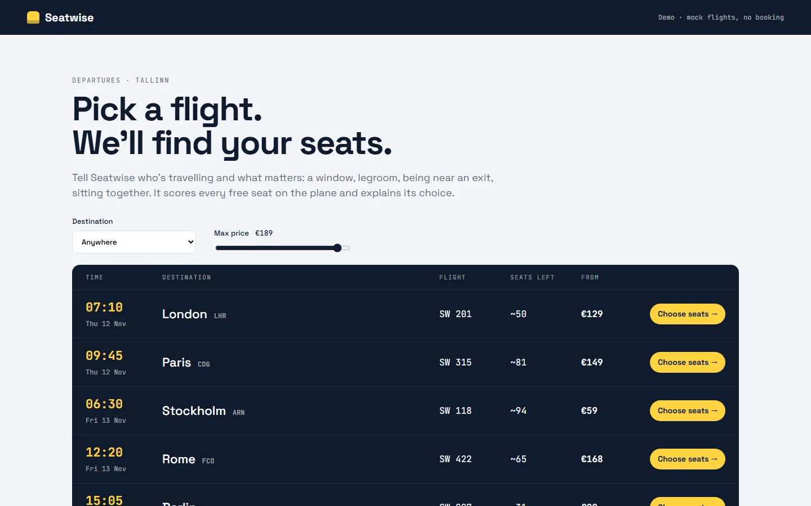
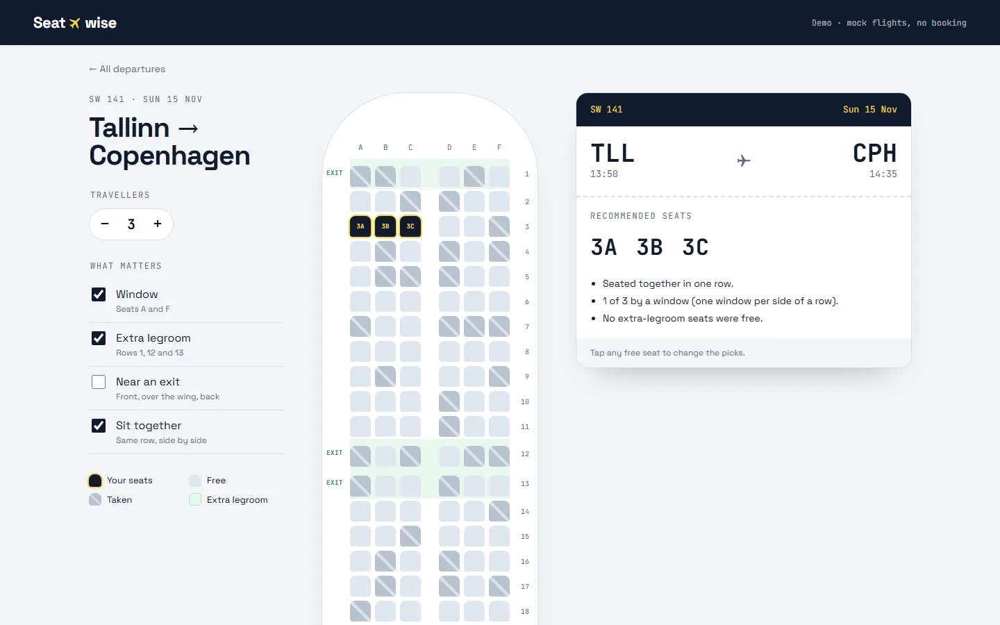

# Seatwise

Pick a flight, say who's travelling and what matters (a window, extra legroom, being near an exit, sitting together), and Seatwise picks the best free seats on the plane and explains its choice. Tap any seat to override it.

**Live:** https://seatwise-flights.vercel.app





## How the recommendation works

The cabin is an A320-style layout: 30 rows of `A B C | D E F`, exits at the front, over the wing (rows 12–13) and at the back, extra legroom in rows 1, 12 and 13. Each flight's taken seats are generated from its id with a seeded random generator, so the map is the same on every visit, and window and aisle seats sell first, like on a real flight.

[`src/lib/recommend.ts`](src/lib/recommend.ts) scores every free seat:

| Preference    | Points                                              |
| ------------- | --------------------------------------------------- |
| Window        | +3 for seats A and F                                |
| Extra legroom | +3 in rows 1, 12 and 13                             |
| Near an exit  | +3 at an exit row, half a point less per row away   |
| (always)      | a tiny bonus for rows nearer the front, to break ties |

With **sit together**, it looks at every run of free, side-by-side seats in one row that fits the group, and picks the highest-scoring run. Crossing the aisle (C to D) is allowed but costs a point, so a couple gets `D E` before `C D`. If no row has room, the group is split over the best two neighbouring rows, and the result says so. Without it, the top-scoring seats win wherever they are.

Every result comes with notes on what was and wasn't possible, for example "1 of 3 by a window (one window per side of a row)".

Preferences live in the URL, so a search can be shared or reloaded.

## Stack

React 19 · TypeScript · React Router · Vite · Vitest · plain CSS · deployed on Vercel

## Run it

```bash
npm install
npm run dev
npm test        # recommendation and cabin tests
npm run build   # type-checks, then builds
```

## History

This started in 2025 as my first full React project, a take-home task I couldn't finish at the time: the seat map visual and Tailwind setup got the better of me. In 2026 I rebuilt it from scratch in TypeScript with a tested recommendation algorithm, a real cabin layout and its own design.
